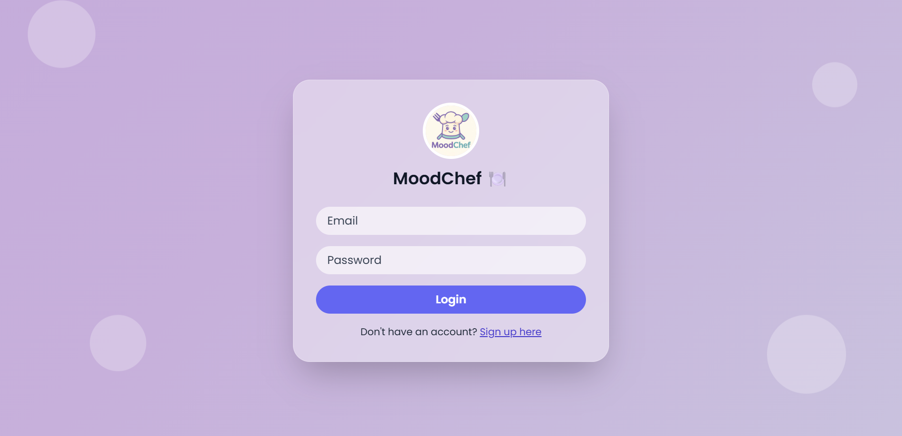
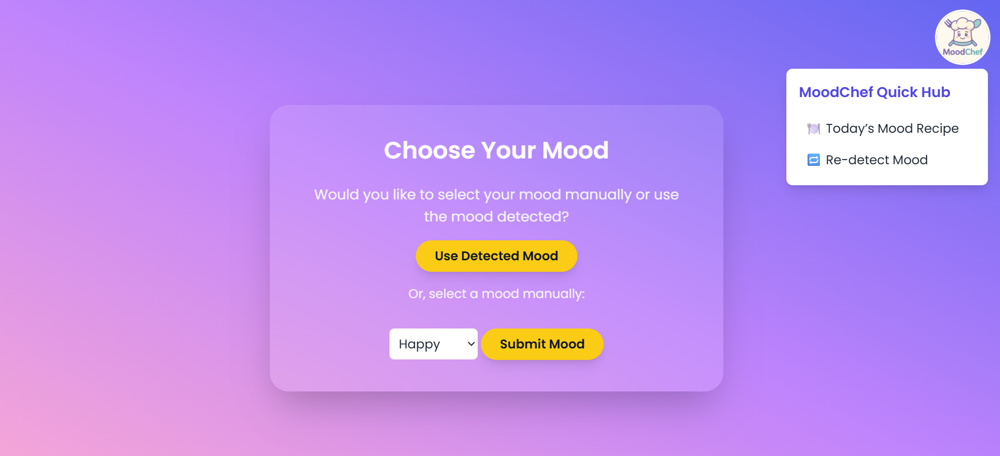
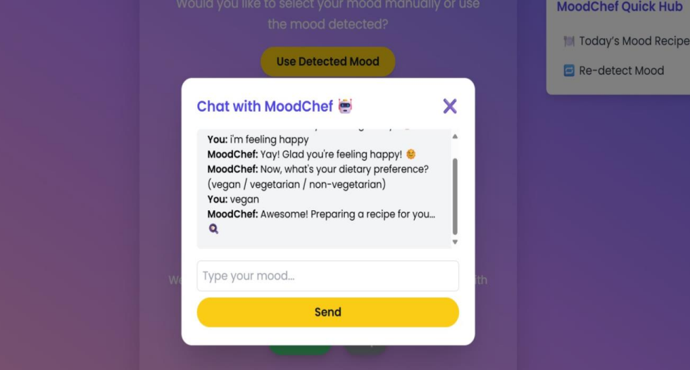
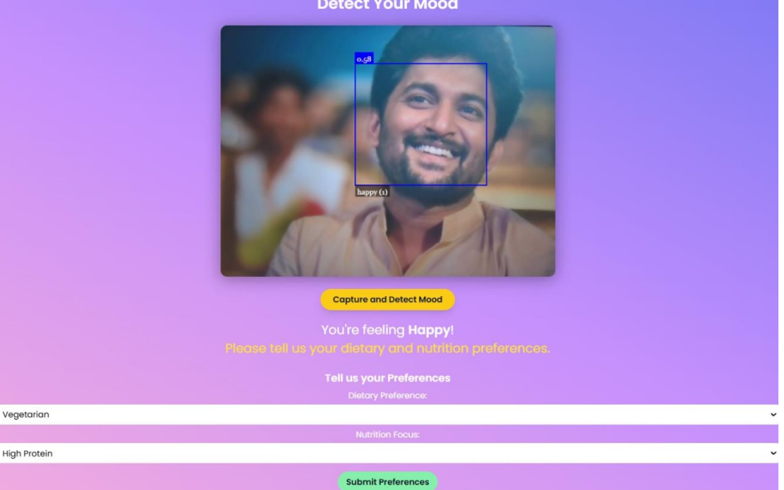
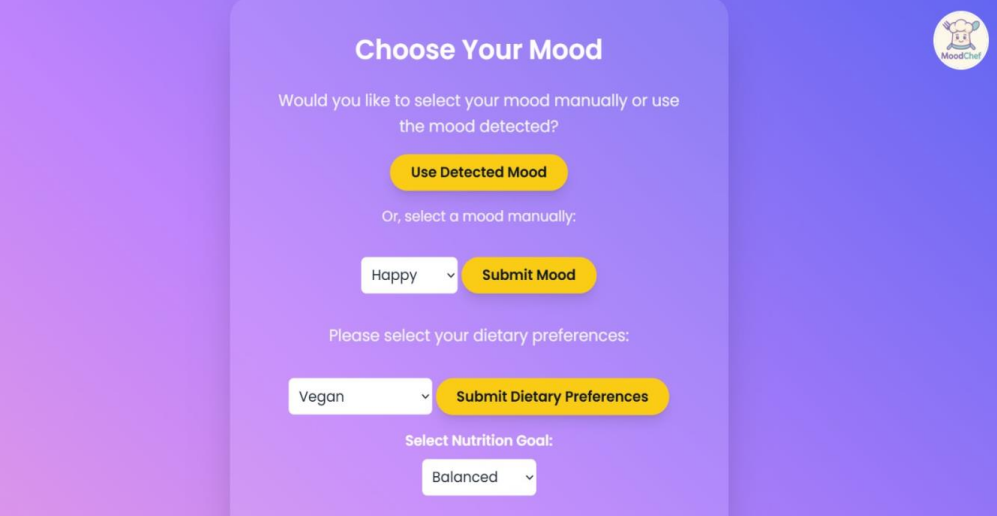
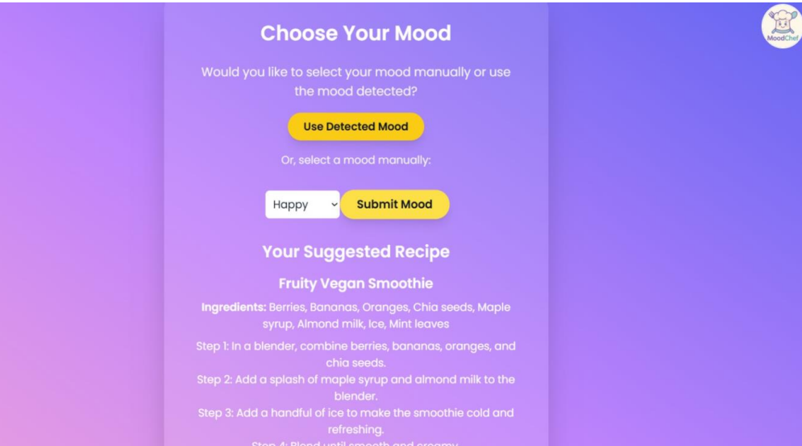
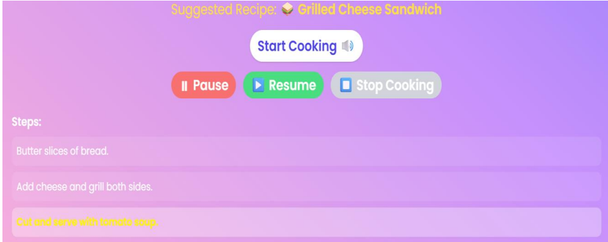

# MoodChef — Mood-Based Smart Recipe Recommender With Cooking Assistance

> *"Your mood decides the menu."*

**MoodChef** is an AI-powered web application that understands how you feel and recommends the perfect recipe for your mood — then guides you through cooking it, step by step, with voice assistance.

Built as a **published research project** — presented at college level and featured in **IJPREMS (2025)**.

## Screenshots

### Login Page
Users can log in to access the MoodChef platform.



---

### Home Page
Users can choose whether to use the detected mood or manually select their mood.



---

### MoodChef Chatbot
Interactive chatbot that collects mood and dietary preferences before generating recipes.



---

### Mood Detection
AI-powered facial emotion recognition detects the user's mood and requests dietary preferences.



---

### Mood & Dietary Preference Selection
Users can manually select mood, dietary preference, and nutrition goals.



---

### Generated Recipe Recommendation
Personalized recipe generated based on mood and dietary preferences.



---

### Voice-Guided Cooking Assistant
Step-by-step cooking instructions with Start, Pause, Resume, and Stop controls.



## The Idea

Ever noticed how food and mood are deeply connected?  
Feeling sad? You crave comfort food.  
Feeling energetic? You want something light and fresh.

**MoodChef bridges this gap** — you tell it how you feel, it tells you what to cook. Then it walks you through the entire recipe with hands-free voice guidance so you never have to touch your phone while cooking.

---

## Features

| Feature | Description |
|---|---|
| User Auth | Secure registration & login with SQLite |
| Mood Detection | Select your current emotional state |
| Diet Preferences | Filter by Vegetarian / Non-Veg / Vegan |
| Smart Recommendations | Mood-to-recipe mapping with curated database |
| Voice Assistant | Hands-free step-by-step cooking guidance |
| Clean UI | Simple, intuitive web interface |

---

## Tech Stack

```
Backend      →  Python · Flask
Database     →  SQLite
Frontend     →  HTML · CSS · JavaScript
AI Logic     →  Mood-to-recipe mapping engine
Voice        →  Web Speech API
Research     →  Published in IJPREMS (2025)
```

---

## Getting Started

### 1. Clone the repo
```bash
git clone https://github.com/SaiDeepthi-22/MoodChef.git
cd MoodChef
```

### 2. Install dependencies
```bash
pip install flask
```

### 3. Set up the database
```bash
python create_db.py
```

### 4. Run the app
```bash
python app.py
```

Open your browser at `http://localhost:5000`

---

## Project Structure

```
MoodChef/
│
├── app.py                        # Main Flask application
├── create_db.py                  # Database setup script
├── view_users.py                 # View registered users (dev tool)
├── clear_users.py                # Clear user records (dev tool)
│
├── templates/                    # HTML frontend templates
│
├── screenshots/                  # App preview images
│   ├── home.png
│   ├── login.png
│   ├── result-1.png
|   ├── result-2.png
│   └── result-3.png
|   └── result-4.png
│
├── MoodChef_Research_Paper.pdf   # Published IEEE-format research paper
├── MoodChef_Documentation.pdf    # Full project documentation
└── MoodChef_Presentation.pptx    # Project presentation deck
```

---

## 🔍 How It Works

```
User logs in
    ↓
Selects current mood (Happy / Sad / Stressed / Energetic / Calm...)
    ↓
Sets dietary preference (Veg / Non-Veg / Vegan)
    ↓
Mood-to-recipe engine maps emotion → suitable cuisine & dish
    ↓
Personalised recipe recommendations displayed
    ↓
Voice assistant guides through cooking step-by-step
```

---

## Research Publication

This project was developed as a research paper and published in:

**IJPREMS — International Journal of Progressive Research in Engineering Management and Science**
Published: July 2025
[Read the Paper](https://www.ijprems.com/research-paper/moodchefmood-based-smart-recipe--recommender-with-cooking-assistance)

---

## My Role

- **Team Leader** — coordinated development and research
- **Backend Development** — Flask application & routing
- **Database Integration** — SQLite user & recipe management
- **Research & Documentation** — paper writing and presentation

---

## Future Scope

- Real-time AI mood detection via facial expression analysis
- Mobile application (Android/iOS)
- Multi-language recipe support
- Smart kitchen device integration
- Nutrition-aware recommendations

---

*"Built with late nights, lots of chai, and a genuine belief that AI can make everyday life more human."* 🍵
